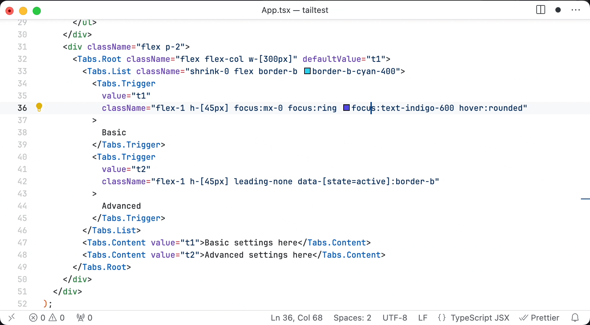

# Tailwind Nested

With Tailwind Nested you can turn your long Tailwind classes into hierarchical view, make changes and compose it back.

## Features

## Keybindings

- <kbd>Ctrl</kbd>+<kbd>Alt</kbd>+<kbd>e</kbd> - Toggle nested view

## License

Licensed under [MIT](./LICENSE).

## Contribution

All contributions are welcome!

If you found a bug or want to propose new feature for the extension, feel free to create an issue.
